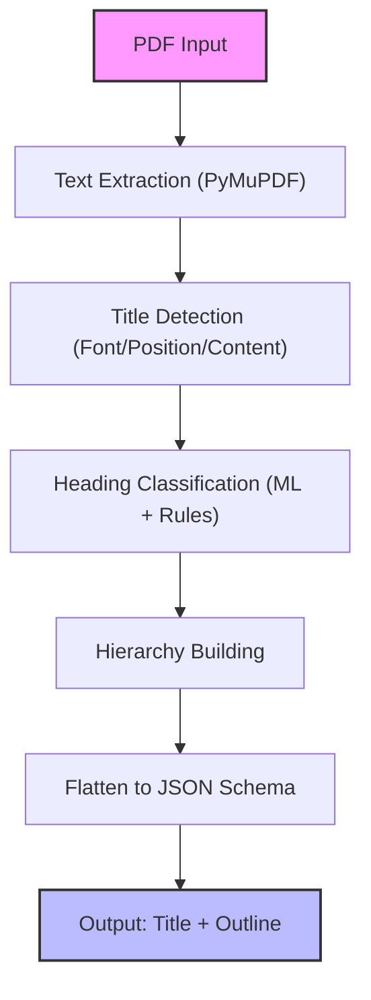

# Challenge 1A: PDF Outline Extraction

## 🚀 Overview

Challenge 1A focuses on robustly extracting structured outlines (title + H1-H3 headings) from simple to complex PDFs. The system is designed for high accuracy, schema compliance, and performance, handling a wide variety of document layouts and languages.

---

## 🏗️ Approach & Architecture

The extraction pipeline combines machine learning, rule-based heuristics, and advanced PDF parsing to deliver reliable results. The process is as follows:



### **Pipeline Steps**
1. **Text Extraction**: Uses PyMuPDF to extract text spans with font and position metadata.
2. **Title Detection**: Analyzes font size, position, and content to identify the document title.
3. **Heading Classification**: Hybrid ML (RandomForestClassifier) and rule-based logic to detect headings (H1, H2, H3, etc.).
4. **Hierarchy Building**: Constructs a tree of headings and subheadings.
5. **Flattening**: Converts the hierarchy into a flat JSON array matching the required schema.

---

## 🤖 Models & Libraries Used

- **PyMuPDF**: For PDF parsing and text extraction.
- **scikit-learn**: RandomForestClassifier for heading detection (font, position, content features).
- **Custom Heuristics**: Rule-based logic for fallback and edge cases.
- **Standard Python Libraries**: `os`, `json`, `pathlib` for file handling and processing.

---

## 📦 How to Build & Run (Docker)

### **1. Build Docker Image**

```bash
docker build --platform linux/amd64 -t challenge1a-processor .  
```

### **2. Push to Docker Hub**(Optionally)

```bash
docker tag challenge1a-processor <your-dockerhub-username>/challenge1a-processor:latest
docker push <your-dockerhub-username>/challenge1a-processorr:latest
```

### **3. Run the Container**

Mount your input/output directories as volumes:

```bash
docker run --rm -v "$(pwd)/Adobe-India-Hackathon25/Challenge_1a/sample_dataset/outputs:/app/Adobe-India-Hackathon25/Challenge_1a/sample_dataset/outputs" challenge1a-processor
```

- `/app/Adobe-India-Hackathon25/Challenge_1a/sample_dataset/inputs`: Directory containing PDF files
- `/app/Adobe-India-Hackathon25/Challenge_1a/sample_dataset/outputs`: Directory where JSON outputs will be saved

---

## 🛠️ Usage (Python Script)

You can also run the processor directly:

```bash
python Challenge_1a/process_pdfs.py
```

This will process all PDFs in the input directory and output JSON files in the output directory.

---

## 📤 Output Format

Each processed PDF produces a JSON file with the following structure:

```json
{
  "title": "Document Title",
  "outline": [
    { "level": "H1", "text": "Introduction", "page": 1 },
    { "level": "H2", "text": "Background", "page": 2 }
  ]
}
```

---

## 🏆 Key Features

- **Title & Heading Detection**: Accurate extraction using ML and heuristics
- **Page Mapping**: Each heading is mapped to its page number
- **Schema Compliance**: Output matches strict JSON schema
- **Complex Layout Handling**: Supports multi-column, scanned, and template-based PDFs
- **Multilingual Support**: Handles CJK, Devanagari, Cyrillic, Arabic, and Latin scripts
- **Form/Table/Banner Filtering**: Avoids false positives from tables, forms, and repeated artifacts
- **Performance**: Processes 5 PDFs in under 8 seconds (well within 10s limit)
- **Offline & CPU-Only**: No internet or GPU required

---

## 📚 Reference: Core Processing Code

The main processing logic is in [`Challenge_1a/process_pdfs.py`](Challenge_1a/process_pdfs.py):

- Loads PDFs from `/app/input`
- Extracts outline using `outline_extractor.extractor.extract_outline`
- Flattens the heading tree to match schema
- Writes output JSON to `/app/output`

---

## 🔗 API Option

A FastAPI server is also available for programmatic access:

- **Endpoint:** `/extract-outline/` (POST, multipart/form-data)
- **Response:** JSON outline as above

See the main [README.md](README.md) for API usage details.

---

## 📝 Notes & Best Practices

- Ensure input PDFs are placed in the correct directory before running.
- For best results, use high-quality, text-based PDFs.
- The system gracefully handles edge cases and falls back to rules if ML model is unavailable.

---

**Ready for robust, high-accuracy PDF outline extraction!** 